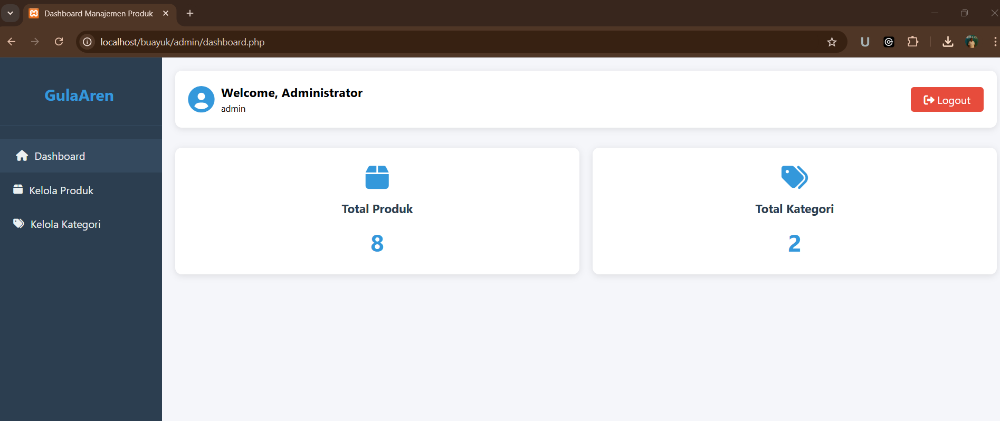
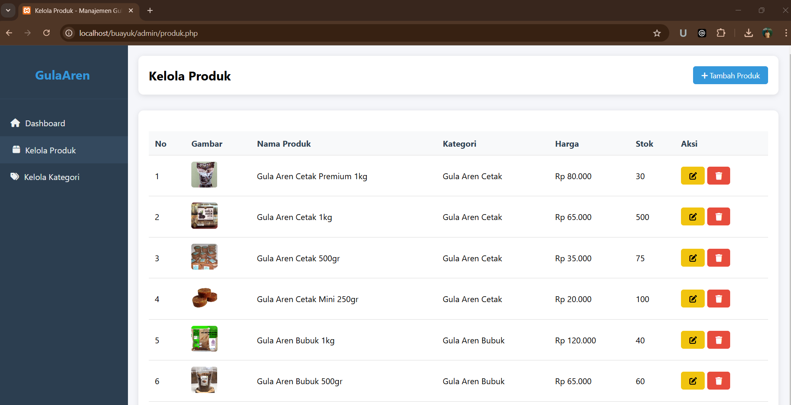
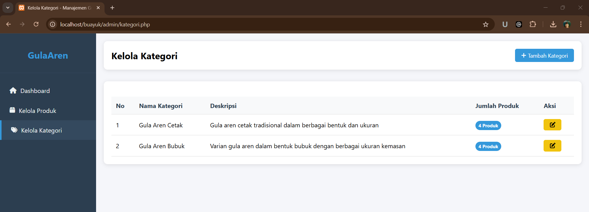

# Sistem Manajemen Produk Gula Aren 🍯

Sistem informasi berbasis web untuk mengelola produk gula aren, termasuk manajemen kategori dan produk dengan antarmuka yang responsif dan user-friendly.

## 📋 Fitur Utama

- **Sistem Autentikasi**
  - Login dengan username dan password
  - Manajemen session
  - Logout system

- **Dashboard**
  - Ringkasan statistik produk dan kategori
  - Interface responsif dengan sidebar navigasi
  - Informasi user yang sedang login

- **Manajemen Kategori**
  - Tambah kategori baru
  - Edit kategori yang ada
  - Hapus kategori (dengan validasi produk terkait)
  - Tampilan jumlah produk per kategori

- **Manajemen Produk**
  - Tambah produk baru dengan upload gambar
  - Edit informasi dan gambar produk
  - Hapus produk
  - Organisasi produk berdasarkan kategori
  - Detail produk lengkap (nama, harga, stok, deskripsi)

## 🛠️ Teknologi yang Digunakan

- **Backend:** PHP
- **Database:** MySQL
- **Frontend:** HTML, CSS, JavaScript
- **Icons:** Font Awesome
- **Design:** Responsive Web Design

## 💻 Prasyarat

Sebelum menjalankan sistem, pastikan telah terinstall:
- PHP >= 7.4
- MySQL/MariaDB
- Web Server (Apache/Nginx)
- Web Browser Modern

## 🚀 Instalasi

1. Clone repository ini
```bash
git clone https://github.com/username/manajemen-gula-aren.git
```

2. Import database
```bash
mysql -u root -p manajemen_gula_aren < manajemen_gula_aren.sql
```

3. Konfigurasi database di `config.php`
```php
$host = "localhost";
$dbuser = "root";
$dbpass = "password_anda";
$dbname = "manajemen_gula_aren";
```

4. Buat folder `uploads` dan berikan permission
```bash
mkdir uploads
chmod 777 uploads
```

5. Akses melalui web browser
```
http://localhost/manajemen-gula-aren
```

## 👤 Default Login

```
Username: admin
Password: admin
```

## 📁 Struktur Database

### Tabel users
- id (Primary Key)
- username
- password (Hashed)
- name

### Tabel kategori
- id_kategori (Primary Key)
- nama_kategori
- deskripsi

### Tabel produk
- id_produk (Primary Key)
- id_kategori (Foreign Key)
- nama_produk
- deskripsi
- harga
- stok
- url_gambar

## 🔒 Keamanan

Sistem ini menerapkan beberapa fitur keamanan:
- SQL Injection Prevention dengan Prepared Statements
- Session Management
- Secure File Upload Handling
- Password Hashing
- Input Validation

## 🎨 Preview





## 👨‍💻 Author

[sangkarsana](https://pasarjateng.com)
